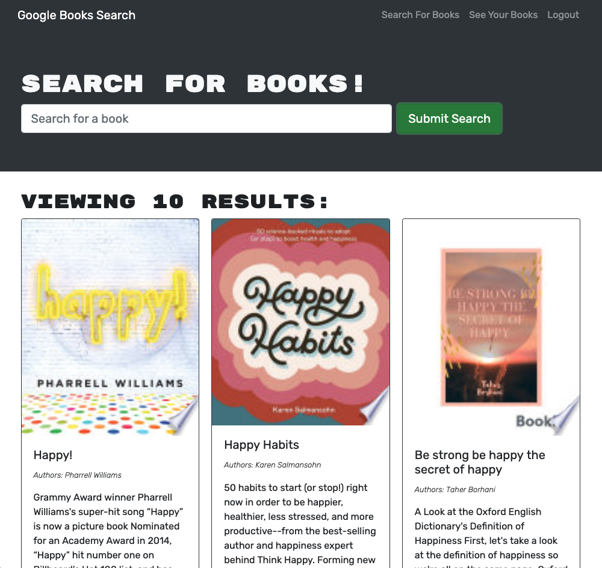

# Google Books Search MERN Application

## Table of Contents
1. [Description](#description)
2. [Screenshot](#screenshot)
3. [Deployment](#deployment)
4. [License](#license)
5. [Questions](#questions)

## Description
This repository contains a Google book search web application. This application was created from the starter code found [HERE](https://github.com/coding-boot-camp/solid-broccoli). It was a fully functioning Google Books API search engine built with a RESTful API, and it has been refactored it to use the GraphQL API built with Apollo Server. The web application was built using the MERN stack, with a React front end, MongoDB database, and Node.js/Express.js server and API. It is set up to allow users to save book searches to the back end.

## Screenshot

## Deployment
This web application is deployed [HERE](https://boiling-wildwood-39680.herokuapp.com/)

## Questions
You can find me [HERE](https://github.com/lstillwe) on Github.

You can email me at lisastillwell@bellsouth.net if you have any additional questions.
